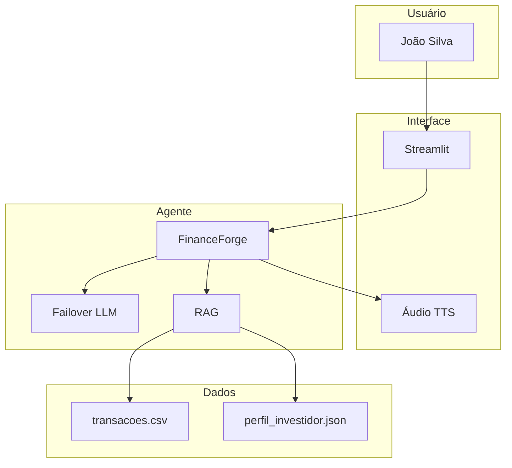

# 01 - Documentação do Agente FinanceForge

## Visão Geral
O FinanceForge é um agente financeiro consultivo, resiliente e anti-alucinação, desenvolvido para o desafio Santander DIO. Utiliza dados reais mockados, failover multi-LLM e interface acessível.

## Persona
Cliente: João Silva
Perfil: Conservador, busca orientação para investir com segurança.

## Diagrama de Arquitetura (Mermaid)

## Fluxo
1. Usuário interage via chat/voz
2. Agente consulta dados mockados
3. Resposta gerada por LLM (com failover)
4. Sugestão proativa e áudio
